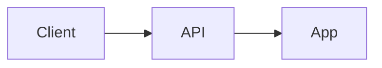

## Summary

<!-- User-facing value in 2–4 sentences (see masterfabric_core PR #8 style). -->

## What changed

1. 
2. 
3. 

## Architecture

<!-- Mermaid flowchart or sequence diagram when behavior/routing changes. -->

## End-to-end flows

<!-- Optional sequence diagram for user-visible paths. -->

## Deep-link / API map (if applicable)

| Source | Endpoint / URL | Result |
|--------|----------------|--------|
| | | |

## Test plan

- [ ] `go test ./...`
- [ ] `docker compose -f deployments/docker-compose.yml up -d` + migrations
- [ ] `GET /health/live` and `GET /health/ready`
- [ ] Grounded places search → route build → save itinerary
- [ ] Ungrounded `place_id` returns 422
- [ ] MCP tools (`plan_day` / `search_places`) exercise the same services

## Merge target

**Base:** `main`  
**Head:** `<!-- branch name -->`

## Commits

<!-- List notable commits if multi-commit PR. -->
